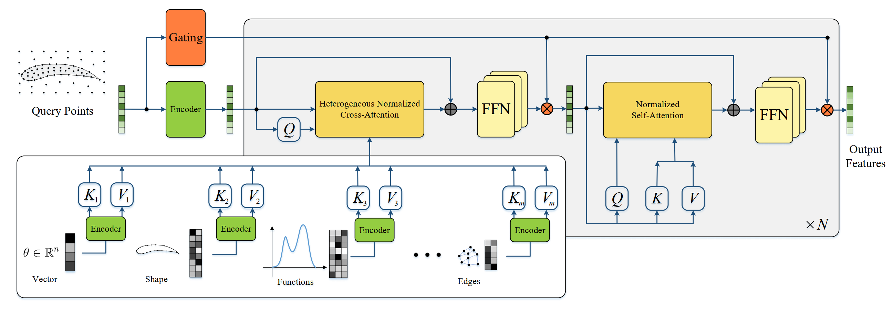
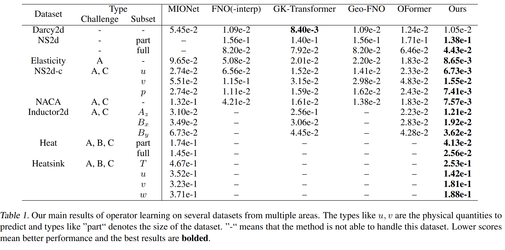
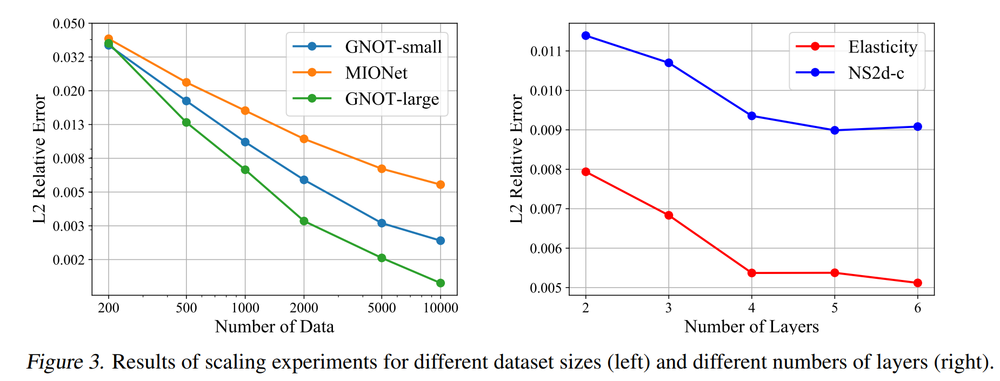

# GNOT: General Neural Operator Transformer (ICML 2023)

Code for [GNOT: A General Neural Operator Transformer for Operator Learning](https://arxiv.org/abs/2302.14376)， accepted at International Conference on Machine Learning (ICML 2023).

- GNOT is a flexible Transformer with linear complexity attention for learning operators or parametric PDE.
- GNOT could handle arbituary number of source functions/ shapes/ parameters.
- GNOT achieves the  state-of-the-art results (SOTA) among 7 highly challenging datasets chosen from fluids, heat, and electromagnetism.




A pretrained GNOT could serves as the surrogate model for predicting physical fields. The inference speed is much more faster compared with traditional numerical solvers. To enabling training neural operators on realistic FEM/FVM simulation data, we design several components to deal with the three challenges, i.e. irregular mesh, multiple (types of) input functions, and multi-scale objective functions. 

<p align="center">
  
</p >


Experiments of GNOT is conducted on multiple challenging datasets selected from multiple domains to show it is capacity to generally solve parametric PDE problems. Here is a overview of these datasets:

<p align="center">
  
</p >


### Get Start

Add dataset folder if it does not exists,

``mdkir data``

``cd data``

In this folder, you can build two folders to store training logs and models

``mkdir logs checkpoints``


Then moves datasets in this folder. For your custom datasets, you might need to modify `args` and `data_utils/get_dataset` functions.

**Dataset Link**

Datasets can be found in these links,
- Darcy2d and NS2d-time (from FNO's experiments):  [FNO datasets](https://drive.google.com/drive/folders/1UnbQh2WWc6knEHbLn-ZaXrKUZhp7pjt-)
- Naca2d and Elas2d (from GeoFNO's experiments): [GeoFNO datasets](https://drive.google.com/drive/folders/1YBuaoTdOSr_qzaow-G-iwvbUI7fiUzu8)
- Heat2d, ns2d, Inductor2d, Heatsink3d: [Our GNOT datasets](https://drive.google.com/drive/folders/1kicZyL1t4z6a7B-6DJEOxIrX877gjBC0)

**Data Format:**

The format of our multi-input-output dataset (MIODataset) should be as follows:

```python
Dataset = [
    [X1, Y1, Theta1, Inputs_funcs1],
    [X2, Y2, Theta2, Inputs_funcs2],
   ...
]
```
- **X**: (N x N_in) numpy array, representing input mesh points
    - N: number of points
    - N_in: input spatial dimension
- **Y**: (N x N_out) numpy array, representing physical fields defined on these mesh points
    - N_out: output dimension, N_out must be at least 1, shape (N,) is not allowed
- **Theta**: (N_theta,) numpy array, global parameters for this sample
    - N_theta: dimension of global parameters
- **Input_funcs**: `tuple (inputs_1, ..., inputs_n)`，every `inputs_i` is a numary array of shape (N_i, f_i), it can be (None,) :
    - N_i: number of points used to discretize this input function
    - f_i: dimension of this input function plus the dimension of geometry, actually it is the concat of (x_i, f(x_i)).
    
- **Note:**
    - For a single sample, The number of points must match, i.e, ``X.shape[0]=Y.shape[0]``, but it can vary with samples
    - For global parameters, the dimension must be the same across all samples


### Training


To train GNOT model, parameters could be updated using argparser or modifying args.py file

```python
python train.py --gpu 0 --dataset ns2d_4ball --use-normalizer unit  --normalize_x unit --component all --comment rel2  --loss-name rel2 --epochs 500 --batch-size 4 --model-name CGPT --optimizer AdamW --weight-decay 0.00005   --lr 0.001 --lr-method cycle  --grad-clip 1000.0   --n-hidden 128 --n-layers 3  --use-tb 0 
```


### Results of GNOT

Main experimental result for GNOT:



Besides, as a transformer architecture, we verify its scaling properties with more data and larger network capacity. This suggests that it is possible to scaling up the architecture for solving larger problems.



### Code Structure

- ``args.py:`` specify hyperparameters for models
- ``train.py:`` main training function
- ``data_utils.py:`` includes dataset, loss functions
- ``models/`` folder for GNOT

### Citation

If you use GNOT in your research, please use the following BibTeX entry.
```
@article{hao2023gnot,
  title={GNOT: A General Neural Operator Transformer for Operator Learning},
  author={Hao, Zhongkai and Ying, Chengyang and Wang, Zhengyi and Su, Hang and Dong, Yinpeng and Liu, Songming and Cheng, Ze and Zhu, Jun and Song, Jian},
  journal={arXiv preprint arXiv:2302.14376},
  year={2023}
}
```
